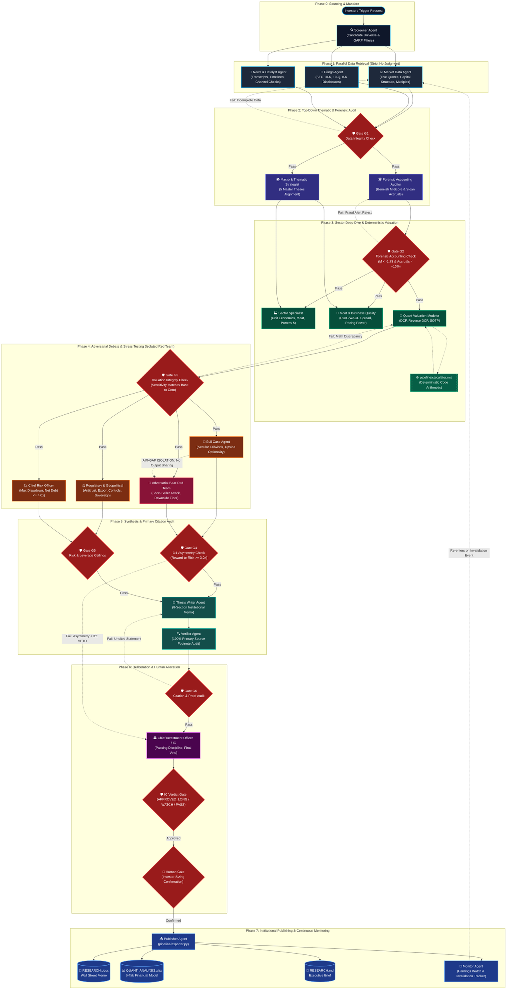

# คู่มือการติดตั้งและใช้งานฉบับสมบูรณ์ (End-to-End How-to-Use Guide)
# Institutional Multi-Agent Hedge Fund & Tier-1 VC Equity Research System

คู่มือฉบับสมบูรณ์สำหรับการติดตั้ง ตั้งค่าเชื่อมต่อกับ AI Agents ทุกค่าย (Antigravity, Claude Code, Cursor, Windsurf, Cline, Codex, OpenAI, CrewAI) และการสั่งงานเชิงลึกตั้งแต่เริ่มต้นจนถึงการใช้คำสั่งระดับสูงอย่าง **/goal** และ **/boost**

---

## สารบัญ (Table of Contents)
1. [ภาพรวมระบบและสถาปัตยกรรม (System Overview)](#1-ภาพรวมระบบและสถาปัตยกรรม-system-overview)
2. [ความต้องการของระบบ (System Requirements & Prerequisites)](#2-ความต้องการของระบบ-system-requirements--prerequisites)
3. [คู่มือการติดตั้ง (Installation Guide: npm, npx, git)](#3-คู่มือการติดตั้ง-installation-guide-npm-npx-git)
4. [การเชื่อมต่อกับ AI Agents ทั่วไป (Universal AI Agent Integration)](#4-การเชื่อมต่อกับ-ai-agents-ทั่วไป-universal-ai-agent-integration)
   - 4.1 Google Antigravity (AGY)
   - 4.2 Claude Code (Anthropic)
   - 4.3 Cursor IDE & Windsurf
   - 4.4 VS Code (Cline & Roo Code)
   - 4.5 Claude Desktop
   - 4.6 OpenAI Codex, GPT-4o & xAI Grok
   - 4.7 Multi-Agent Frameworks (CrewAI & LangGraph)
   - 4.8 Web Chat UI (ChatGPT, Claude.ai, Grok, DeepSeek)
5. [เจาะลึกคำสั่ง `/goal` และ `/boost` (Deep Dive: /goal & /boost)](#5-เจาะลึกคำสั่ง-goal-และ-boost-deep-dive-goal--boost)
   - ความหมายและการทำงานของ `/goal`
   - ความหมายและการทำงานของ `/boost`
   - รวมพลัง `/goal` + `/boost` ในคำสั่งเดียว
   - ชุดคำสั่งสำเร็จรูป (Prompt Cheat Sheet) สำหรับ 5 สถานการณ์จริง
6. [ขั้นตอนการวิเคราะห์หุ้นทีละสเต็ป (Step-by-Step Research Workflow)](#6-ขั้นตอนการวิเคราะห์หุ้นทีละสเต็ป-step-by-step-research-workflow)
7. [การรัน Multi-Stock Screening เปรียบเทียบหลายตัวพร้อมกัน](#7-การรัน-multi-stock-screening-เปรียบเทียบหลายตัวพร้อมกัน)
8. [คู่มือคำสั่ง CLI และพารามิเตอร์ (CLI Reference)](#8-คู่มือคำสั่ง-cli-และพารามิเตอร์-cli-reference)
9. [การตรวจสอบคุณภาพและ Quality Gates (G1 - G6)](#9-การตรวจสอบคุณภาพและ-quality-gates-g1---g6)
10. [การแก้ปัญหาที่พบบ่อย (Troubleshooting & FAQ)](#10-การแก้ปัญหาที่พบบ่อย-troubleshooting--faq)

---

## 1. ภาพรวมระบบและสถาปัตยกรรม (System Overview)

`investment-research` เป็นระบบปฏิบัติการวิจัยการลงทุนระดับสถาบันที่จำลองโครงสร้างองค์กรของ **Hedge Funds ชั้นนำระดับโลก** (Tiger Cubs, Point72, Citadel) และ **Tier-1 VC** (Sequoia, Founders Fund):

1. **Deterministic Arithmetic in Code**: แยกการคำนวณตัวเลขทางการเงิน (DCF, Reverse DCF, SOTP, Graham Number, Sensitivity Matrix) ออกจากการเดาสุ่มของ LLM Tokens อย่างเด็ดขาด โดยรันผ่านโค้ดจริงใน `pipeline/calculator.mjs` พร้อมระบบตรวจสอบ Gate G3
2. **Strict Separation of Data & Judgment**: Data Agents ดึงข้อมูลจริงจาก SEC Filings (10-K, 10-Q, 8-K) เท่านั้น ห้ามตีความเอง ส่วน Specialist Agents ตีความจากข้อมูลที่ดึงมาเท่านั้น ห้ามเข้าเว็บเดาสุ่ม
3. **The 3:1 Asymmetric Reward-to-Risk Hurdle**: หุ้นที่จะผ่านการอนุมัติ Long (`APPROVED_LONG`) จะต้องมี Upside ต่อ Base Fair Value สูงกว่า Downside ไปยัง Bear Floor อย่างน้อย **3.0 เท่า**
4. **Institutional Passing Discipline**: วินัยในการ "ปฏิเสธ" หุ้นยอดฮิตที่เข้าข่ายกับดัก เช่น Cyclical Commodity Traps (เช่น `MU`), Multiple Derating จากคู่แข่งกินรวบ (เช่น `ISRG`), Leverage สูงเกิน Net Debt / EBITDA > 4.0x (เช่น `EQIX`), สงครามราคา (เช่น `BABA`), หรือเสียเปรียบด้าน Scale (เช่น `AMBA`)
5. **Adversarial Red Team Short-Seller Attack**: บังคับให้ Bear Agent โจมตี Thesis แบบ Short-Seller (Hindenburg / Muddy Waters) อย่างเป็นอิสระ กำหนด 4+ ข้อโต้แย้งที่พิสูจน์ค้านได้ และ 2+ Numeric Kill Criteria
6. **Exclusive Desktop Deliverables**: ส่งออกผลงานวิจัยสมบูรณ์แบบตรงสู่ `~/Desktop/<TICKER>/`:
   - `RESEARCH.docx`: Investment Memo 8 บทความระดับ Wall Street ดีไซน์มืออาชีพ
   - `QUANT_ANALYSIS.xlsx`: โมเดลการเงินระดับสถาบัน 6 แท็บสมบูรณ์แบบ
   - `RESEARCH.md`: สรุปย่อสำหรับผู้บริหาร
   - `ic-verdict.json`: มติคณะกรรมการลงทุนและขนาดพอร์ตโฟลิโอ (Fractional Kelly)

### แผนผังลำดับการทำงานของ Multi-Agent DAG (Architecture Flowchart):



---

## 2. ความต้องการของระบบ (System Requirements & Prerequisites)

ระบบออกแบบตามหลักการ **Zero External Dependencies** เพื่อให้สามารถรันบนเครื่องใดก็ได้ทันทีโดยไม่ต้องติดตั้งไลบรารีภายนอกที่เสี่ยงต่อความไม่ปลอดภัย:

- **Node.js**: เวอร์ชัน `18.0.0` ขึ้นไป (ใช้สำหรับรัน Deterministic Financial Calculator, CLI และ MCP Server)
- **Python**: เวอร์ชัน `3.8` ขึ้นไป (ใช้ Standard Library ล้วน: `zipfile`, `xml.etree.ElementTree`, `json` สำหรับสร้างไฟล์ `.docx` และ `.xlsx`)
- **Operating System**: macOS, Linux, Windows (WSL / PowerShell)
- **สิทธิ์การเขียนไฟล์**: โฟลเดอร์ `~/Desktop/` สำหรับสร้างโฟลเดอร์ผลงานวิเคราะห์

### ตรวจสอบความพร้อมของเครื่อง:
```bash
node -v           # ต้องได้ v18.0.0 หรือสูงกว่า
python3 --version # ต้องได้ Python 3.8 หรือสูงกว่า
```

---

## 3. คู่มือการติดตั้ง (Installation Guide: npm, npx, git)

คุณสามารถเลือกติดตั้งและใช้งานได้ 4 รูปแบบตามความสะดวก:

### วิธีที่ 3.1: ติดตั้งแบบ Global ผ่าน npm (`npm install -g`) [แนะนำสำหรับ Terminal & CLI]
ติดตั้งคำสั่ง `investment-research` และ `investment-research-calc` ลงในระบบทั่วทั้งเครื่อง:

```bash
# ติดตั้งตรงจาก GitHub Repository
npm install -g git+https://github.com/Bravetrunk/investment-research.git

# หรือหากเผยแพร่บน npm registry:
# npm install -g investment-research
```

ตรวจสอบการติดตั้ง:
```bash
investment-research --help
investment-research-calc --help
```

### วิธีที่ 3.2: ใช้งานทันทีโดยไม่ต้องติดตั้ง (`npx`) [Zero Install]
เหมาะสำหรับการรันด่วน หรือนำไปผูกใน config ของ Agent:

```bash
# รันคำสั่งทั่วไปผ่าน npx
npx -y -p git+https://github.com/Bravetrunk/investment-research investment-research --help

# รันคำนวณโมเดล DCF ผ่าน npx
npx -y -p git+https://github.com/Bravetrunk/investment-research investment-research-calc ~/Desktop/CEG/valuation-model.json --write

# รัน MCP Server ผ่าน npx สำหรับเชื่อมต่อ Agent
npx -y -p git+https://github.com/Bravetrunk/investment-research investment-research-mcp
```

### วิธีที่ 3.3: ติดตั้งในโปรเจกต์เดิม (`npm install`)
หากคุณมีโปรเจกต์ Node.js / TypeScript ที่ต้องการเรียกใช้ฟังก์ชันการประเมินมูลค่า:

```bash
npm install git+https://github.com/Bravetrunk/investment-research.git
```

เรียกใช้งานในโค้ด:
```javascript
import { dcf, solveReverseDCF, evaluatePassingDiscipline } from "investment-research";

const revDcf = solveReverseDCF({
  currentPrice: 150.0,
  shares: 315.0,
  fcfBase: 3200.0,
  discountRate: 0.09,
  terminalGrowthRate: 0.025
});
console.log("Implied growth rate CAGR:", revDcf.implied_growth_pct);
```

### วิธีที่ 3.4: ติดตั้งลงในโฟลเดอร์ Skills ของ AI Agent
สำหรับ Google Antigravity หรือ Agent ที่มีโฟลเดอร์สกิลเฉพาะตัว:

```bash
mkdir -p ~/.gemini/config/skills/investment-research
git clone https://github.com/Bravetrunk/investment-research.git ~/.gemini/config/skills/investment-research
```

---

## 4. การเชื่อมต่อกับ AI Agents ทั่วไป (Universal AI Agent Integration)

`investment-research` รองรับมาตรฐานเปิด **Model Context Protocol (MCP)** และ **Standard CLI / JSON I/O** ทำให้สามารถทำงานร่วมกับ AI Coding Agents ทุกค่ายได้ทันที:

| AI Platform / Agent | ช่องทางการเชื่อมต่อ | Zero Install (`npx`) | Native MCP | Slash Commands (/goal, /boost) |
| :--- | :--- | :---: | :---: | :---: |
| **Google Antigravity (AGY)** | Builtin Skill / Subagents / MCP | ✅ | ✅ | ✅ สมบูรณ์แบบ |
| **Claude Code (Anthropic)** | Native MCP / `CLAUDE.md` / CLI | ✅ | ✅ | ✅ สมบูรณ์แบบ |
| **Cursor IDE** | MCP / `.cursorrules` / `.mdc` Rule | ✅ | ✅ | ✅ ผ่าน Chat/Composer |
| **Windsurf (Cascade)** | MCP / `.windsurfrules` | ✅ | ✅ | ✅ ผ่าน Cascade |
| **VS Code (Cline / Roo Code)**| MCP stdio Server | ✅ | ✅ | ✅ ผ่าน Chat |
| **Claude Desktop** | MCP stdio Server | ✅ | ✅ | N/A |
| **OpenAI Codex / GPT-4o** | Function Calling JSON Schema | ✅ | ผ่าน API | N/A |
| **xAI Grok** | Tool Calling API / System Prompt | ✅ | ผ่าน API | N/A |
| **CrewAI / LangGraph** | Python Tool Adapters | N/A | N/A | ✅ |

---

### 4.1 Google Antigravity (AGY)
Antigravity จะตรวจจับสกิลอัตโนมัติเมื่อติดตั้งไว้ใน `~/.gemini/config/skills/investment-research`

**การสั่งงานใน Antigravity Chat:**
- ใช้ภาษาธรรมชาติหรือพิมพ์คำสั่ง `/goal` และ `/boost` เพื่อรัน Subagents แบบขนานและส่งออกผลงานสู่ Desktop อัตโนมัติ

---

### 4.2 Claude Code (Anthropic)
เพิ่ม `investment-research` เข้าเป็นเครื่องมือประจำของ Claude Code ด้วยคำสั่งเดียวใน Terminal:

```bash
claude mcp add investment-research -- npx -y -p github:Bravetrunk/investment-research investment-research-mcp
```

เมื่อเชื่อมต่อแล้ว Claude Code จะสามารถเรียกใช้ Tools ทั้ง 8 ตัวได้เอง:
- `calculate_valuation`
- `solve_reverse_dcf`
- `calculate_sotp`
- `calculate_forensic_accounting`
- `evaluate_passing_discipline`
- `export_research_artifacts`
- `init_workspace`
- `verify_valuation_model`

ในโฟลเดอร์ของโปรเจกต์มีไฟล์ [`CLAUDE.md`](./CLAUDE.md) คอยกำกับการทำงานให้ปฏิบัติตามวินัยของกองทุนอย่างเคร่งครัด

---

### 4.3 Cursor IDE & Windsurf
#### การติดตั้งใน Cursor:
1. เปิด **Cursor Settings** (`Cmd + ,` หรือ `Ctrl + ,`)
2. ไปที่แท็บ **Features** $\to$ **MCP**
3. คลิก **+ Add New MCP Server**:
   - **Name**: `investment-research`
   - **Type**: `command`
   - **Command**: `npx -y -p github:Bravetrunk/investment-research investment-research-mcp`
4. โปรเจกต์มีไฟล์ [`.cursorrules`](./.cursorrules) และ [`.cursor/rules/investment-research.mdc`](./.cursor/rules/investment-research.mdc) พร้อมใช้งานทันที

#### การติดตั้งใน Windsurf (Cascade):
เพิ่มคอนฟิกใน `~/.codeium/windsurf/mcp_config.json`:
```json
{
  "mcpServers": {
    "investment-research": {
      "command": "npx",
      "args": [
        "-y",
        "-p",
        "github:Bravetrunk/investment-research",
        "investment-research-mcp"
      ]
    }
  }
}
```

---

### 4.4 VS Code (Cline & Roo Code)
เพิ่มคอนฟิกลงใน MCP Settings ของ Cline หรือ Roo Code:

```json
{
  "mcpServers": {
    "investment-research": {
      "command": "npx",
      "args": [
        "-y",
        "-p",
        "github:Bravetrunk/investment-research",
        "investment-research-mcp"
      ],
      "disabled": false,
      "autoApprove": [
        "calculate_valuation",
        "solve_reverse_dcf",
        "calculate_sotp",
        "calculate_forensic_accounting",
        "evaluate_passing_discipline"
      ]
    }
  }
}
```

---

### 4.5 Claude Desktop
เปิดไฟล์คอนฟิก:
- **macOS**: `~/Library/Application Support/Claude/claude_desktop_config.json`
- **Windows**: `%APPDATA%\Claude\claude_desktop_config.json`

วางคอนฟิก:
```json
{
  "mcpServers": {
    "investment-research": {
      "command": "npx",
      "args": [
        "-y",
        "-p",
        "github:Bravetrunk/investment-research",
        "investment-research-mcp"
      ]
    }
  }
}
```

---

### 4.6 OpenAI Codex, GPT-4o & xAI Grok
ใช้งานผ่าน Function Calling โดยใช้ Schema จาก [`integrations/openai_codex_tools.json`](./integrations/openai_codex_tools.json) และสคริปต์รันตัวอย่างใน [`integrations/openai_codex_agent.py`](./integrations/openai_codex_agent.py):

```python
from integrations.openai_codex_agent import execute_tool_call

# เรียกคำนวณ Reverse DCF ผ่าน Code จริง
result = execute_tool_call("solve_reverse_dcf", {
    "current_price": 294.3,
    "shares": 356.5,
    "fcf_base": 3800.0,
    "discount_rate": 0.075,
    "terminal_growth_rate": 0.025
})
print(result)
```

---

### 4.7 Multi-Agent Frameworks (CrewAI & LangGraph)
- **CrewAI**: นำเข้า Custom Tools จาก [`integrations/crewai_tool.py`](./integrations/crewai_tool.py):
  `DeterministicValuationTool`, `ReverseDCFTool`, `ForensicAccountingTool`, `PassingDisciplineTool`, `ResearchExporterTool`
- **LangChain / LangGraph**: นำเข้าฟังก์ชัน `@tool` จาก [`integrations/langchain_tools.py`](./integrations/langchain_tools.py)

---

### 4.8 Web Chat UI (ChatGPT Plus, Claude.ai, Grok, DeepSeek)
คัดลอก System Prompt ระดับสถาบันจาก [`integrations/system_prompts.md`](./integrations/system_prompts.md) ไปวางใน **Custom Instructions** หรือเริ่มแชทใหม่เพื่อควบคุมให้ AI ตอบตามหลักการและรูปแบบ 8 หัวข้อของกองทุน

---

## 5. เจาะลึกคำสั่ง `/goal` และ `/boost` (Deep Dive: /goal & /boost)

ในการทำงานร่วมกับ AI Coding Agents ยุคใหม่ (โดยเฉพาะ Google Antigravity, Claude Code, Cursor, Windsurf) การใช้ Slash Commands เป็นเทคนิคสำคัญในการกำหนด **Mandate (เป้าหมาย)** และ **Execution Velocity (โหมดการรันเชิงลึก)**:

```text
┌──────────────────────────────────────────────────────────────────────────────────┐
│  /goal <เป้าหมายการลงทุน, หุ้น, เกณฑ์ผลตอบแทน>                                  │
│  ↳ กำหนด Investment Mandate, Scope, กรอบสมมติฐาน, เกณฑ์ความปลอดภัย และ Hurdle Rate │
├──────────────────────────────────────────────────────────────────────────────────┤
│  /boost <คำสั่งเร่งสปีด, รัน Subagents เบื้องหลัง, รัน Deterministic Engine>      │
│  ↳ สั่งให้ Agent รันแบบ Autonomous, แตก Subagent ขนาน, คำนวณในโค้ด และสร้างไฟล์   │
└──────────────────────────────────────────────────────────────────────────────────┘
```

---

### ความหมายและการทำงานของ `/goal`
`/goal` ใช้สำหรับกำหนด **วัตถุประสงค์ของการวิเคราะห์หุ้น (Investment Objective)**:
- ระบุชื่อหุ้น (Ticker) หรือกลุ่มอุตสาหกรรม
- ระบุ Thesis หรือ Thematic Alignment (เช่น Liquid Cooling, Nuclear Power, Robotics)
- กำหนด Hurdle Rate หรือข้อจำกัดความเสี่ยง (เช่น ต้องผ่าน Asymmetric Hurdle 3:1, Net Debt/EBITDA ไม่เกิน 4.0x)
- ระบุผลลัพธ์ที่ต้องการ (เช่น โมเดล 6 แท็บ Excel, Word Memo, หรือ Screen Comparison)

**โครงสร้าง Syntax ของ `/goal`:**
```text
/goal วิเคราะห์หุ้น [TICKER] ผ่านกรอบ [THEME / CRITERIA] ประเมินมูลค่าด้วย DCF และ Reverse DCF พร้อมทดสอบ Bear Case Floor และส่งออกไฟล์ที่ ~/Desktop/[TICKER]/
```

---

### ความหมายและการทำงานของ `/boost`
`/boost` ใช้สำหรับสั่งให้ AI Agent **ทำงานแบบ Turbo Autonomous / Subagent Delegation**:
1. **ข้ามขั้นตอนถามซ้ำซาก**: สั่งให้ Agent รัน Pipeline ต่อเนื่องตั้งแต่ต้นจนจบ
2. **รัน Subagents แบบ Parallel**: สั่งให้แยก Data Agents (10-K, Market Data) และ Analytical Specialists (Forensic, Sector, Macro) ออกจากกัน
3. **บังคับรันโค้ดจริง**: สั่งให้ Agent เรียก `investment-research-calc` หรือ `calculator.mjs` แทนที่จะคำนวณตัวเลขในใจ
4. **Isolated Red Team Attack**: สั่งให้ Bear Agent โจมตีแบบ Short-Seller แยกห้องโดยไม่ฮั้วกับ Bull Agent
5. **สร้างเอกสารส่งมอบทันที**: รัน `pipeline/exporter.py` เพื่อสร้าง `RESEARCH.docx` และ `QUANT_ANALYSIS.xlsx`

---

### รวมพลัง `/goal` + `/boost` ในคำสั่งเดียว (The Institutional Power Combo)

เมื่อคุณนำ `/goal` และ `/boost` มารวมกัน Agent จะเข้าใจทั้ง **ขอบเขตการลงทุน (What)** และ **โหมดการลงมือทำแบบครบวงจร (How)** ได้อย่างสมบูรณ์แบบ:

```text
/goal ทำ Institutional Deep-Dive หุ้น Constellation Energy (CEG) โดยประเมินมูลค่าโรงไฟฟ้านิวเคลียร์เพื่อรองรับ AI Data Centers ตาม Thematic Liquid Cooling & Power 2026 พร้อมทดสอบเกณฑ์ Asymmetry >= 3:1
/boost ให้แตก Subagent รัน DAG เต็มรูปแบบ ดึง 10-K ล่าสุด คำนวณ DCF และ Reverse DCF ด้วย deterministic calculator ในโค้ด โจมตีด้วย Bear Red-Team หา Kill Criteria 2 ข้อ และ compile ทั้ง RESEARCH.docx และ QUANT_ANALYSIS.xlsx 6 แท็บออกมาที่ ~/Desktop/CEG/
```

---

### ชุดคำสั่งสำเร็จรูป (Prompt Cheat Sheet) สำหรับ 5 สถานการณ์จริง

คุณสามารถคัดลอกข้อความด้านล่างนี้ไปสั่งใน AI Agent ได้ทันที:

#### 1. วิเคราะห์หุ้นเดี่ยวแบบเจาะลึกสถาบัน (Constellation Energy - `CEG`)
```text
/goal วิเคราะห์มูลค่าหุ้น CEG (Constellation Energy) เจาะลึกสัญญา PPA กับ Big Tech และการเปิดเตาปฏิกรณ์ Three Mile Island (Crane Clean Energy Center)
/boost ใช้ skill investment-research รัน institutional DAG เต็มรูปแบบ:
1. สร้าง workspace ที่ ~/Desktop/CEG/
2. ดึงงบการเงินและคำนวณ Beneish M-Score และ Sloan Accruals
3. กำหนดสมมติฐาน DCF 3 กรณี (Base WACC 7.5%, TG 2.5%) แล้วรันคำนวณผ่าน investment-research-calc --write
4. ให้ Bear Agent ออกแบบ 4 ข้อโจมตีและ 2 Numeric Kill Criteria
5. สรุปมติ Investment Committee และคำนวณ Fractional Kelly Sizing
6. สั่ง export สร้าง RESEARCH.docx และ QUANT_ANALYSIS.xlsx 6 แท็บ
```

#### 2. วิเคราะห์หุ้นโครงสร้างระบายความร้อน AI (Vertiv - `VRT`)
```text
/goal ตรวจสอบมูลค่าหุ้น VRT (Vertiv Holdings) เทียบกับ Master Thesis: Liquid Cooling 2026 ว่ามี Moat ในระดับ Direct-to-Chip และ Immersion Cooling จริงหรือไม่
/boost รัน investment-research engine ดึงตัวเลข backlog, ทำ Reverse DCF หาว่าราคาตลาดสะท้อนการเติบโต FCF กี่ % ต่อปี หากพบว่าราคาสูงเกินไป ให้ประเมิน Passing Discipline ว่าเข้าข่าย Multiple Derating หรือไม่ แล้วส่งออกรายงานวิจัยฉบับเต็มไปที่ ~/Desktop/VRT/
```

#### 3. ตรวจสอบการตกแต่งบัญชีและคุณภาพกำไร (Super Micro Computer - `SMCI`)
```text
/goal ทำ Deep Forensic Accounting Audit สำหรับหุ้น SMCI ตรวจสอบความผิดปกติของรายได้ค้างรับ และประเด็นเรื่องลูกหนี้การค้า
/boost รันโหมด forensic_audit คำนวณ Beneish M-Score ทั้ง 8 Sub-indices, คำนวณ Sloan Accrual Ratio และวิเคราะห์วงจรเงินสด (Cash Conversion Cycle) เทียบกับคู่แข่ง ออกรายงาน forensic-report.json และสรุปความเสี่ยงที่ ~/Desktop/SMCI/
```

#### 4. สกรีนเปรียบเทียบหุ้นกลุ่มกลาโหม GARP (`LMT`, `NOC`, `GD`)
```text
/goal สกรีนเปรียบเทียบหุ้นกลุ่ม Allied Rearmament & Defense GARP Screen ระหว่าง LMT, NOC, GD
/boost รัน investment-research screen LMT NOC GD --out ~/Desktop/Defense_Screen เพื่อวิเคราะห์ DCF, Backlog Duration, FCF Conversion และเปรียบเทียบ Asymmetric Risk/Reward ออกมาเป็น SCREEN_COMPARISON.xlsx และ COMPARISON.md
```

#### 5. เฝ้าระวังและตรวจจับการลบล้างสมมติฐานหลังงบออก (Quarterly Invalidation Watch)
```text
/goal มอนิเตอร์งบการเงินไตรมาสล่าสุดของหุ้น CEG เพื่อตรวจสอบว่ามีตัวเลขใดแตะ Invalidation Kill Criteria หรือไม่
/boost รันโหมด thesis_monitor เทียบผลประกอบการจริงกับ kill thresholds ใน ~/Desktop/CEG/thesis-record.json หากมีการละเมิดเกณฑ์ ให้แจ้งเตือนพร้อมเหตุผลในการพิจารณา Liquidate ตำแหน่งทันที
```

---

## 6. ขั้นตอนการวิเคราะห์หุ้นทีละสเต็ป (Step-by-Step Research Workflow)

ระบบแบ่งกระบวนการทำงานออกเป็น 8 เฟสที่รัดกุมตาม DAG (`pipeline/dag.yaml`):

```text
┌──────────────┐     ┌──────────────┐     ┌──────────────┐     ┌──────────────┐
│ Phase 1      │ ──> │ Phase 2      │ ──> │ Phase 3      │ ──> │ Phase 4      │
│ Init Desktop │     │ Data Fetch   │     │ Macro &      │     │ Deterministic│
│ Workspace    │     │ SEC 10-K/Quote│    │ Forensic (G2)│     │ Math (G3)    │
└──────────────┘     └──────────────┘     └──────────────┘     └──────────────┘
                                                                       │
┌──────────────┐     ┌──────────────┐     ┌──────────────┐             │
│ Phase 8      │ <── │ Phase 7      │ <── │ Phase 6      │ <───────────┘
│ Dual Export  │     │ IC Verdict & │     │ Red-Team &   │
│ DOCX + XLSX  │     │ Passing Disc.│     │ G6 Citation  │
└──────────────┘     └──────────────┘     └──────────────┘
```

### Phase 1: สร้าง Workspace ประจำหุ้นบน Desktop
สร้างโฟลเดอร์สำหรับเก็บผลลัพธ์ทั้งหมดไว้ที่ `~/Desktop/<TICKER>/`:
```bash
investment-research init CEG
```

### Phase 2: Data Ingestion (ดึงข้อมูลปฐมภูมิจาก SEC Filings)
Data Agents ดึงข้อมูลทางการเงิน:
- `market-data` $\to$ `financial-snapshot.json`
- `filings` $\to$ `filings-extract.json`
- `news-catalyst` $\to$ `news-timeline.json`
- ผ่านการตรวจสอบ **Gate G1** (ข้อมูลมีที่มา มีวันที่กำกับ ครบถ้วน)

### Phase 3: Macro Thematic & Forensic Accounting Audit
- `macro-thematic`: วิเคราะห์เทียบกับ 5 Master Theses $\to$ `macro-thematic-assessment.json`
- `forensic-accounting`: คำนวณ Beneish M-Score ($M \le -1.78$) และ Sloan Accrual Ratio ($\pm 10\%$) $\to$ `forensic-report.json`
- ผ่านการตรวจสอบ **Gate G2** (Distortion Report และการเจือจางของ SBC)

### Phase 4: Deterministic Valuation Modeling
Specialist กำหนดสมมติฐานใน `valuation-model.json` จากนั้นรันการคำนวณผ่านโค้ด:
```bash
investment-research calc ~/Desktop/CEG/valuation-model.json --write
investment-research calc ~/Desktop/CEG/valuation-model.json --verify
```
- ระบบจะคำนวณ Base / Bull / Bear DCF, Reverse DCF Implied Growth, SOTP, Graham Number, Asymmetric R:R และตาราง Sensitivity Matrix 2D
- ผ่านการตรวจสอบ **Gate G3** (ตัวเลขตรงกัน 100% สามารถทำซ้ำได้ในโค้ด)

### Phase 5: Adversarial Red Team Attack
- `bear-adversarial` รันแบบแยกห้องเดี่ยว (Isolation Barrier) ไม่ให้รู้ข้อมูลของ Bull
- เขียนข้อโจมตีอย่างน้อย 4 ข้อ และกำหนด 2+ Numeric Kill Criteria เช่น *"หากยอดสั่งซื้อ PPA ต่ำกว่า 500 MW หรือราคา Capacity Auction ต่ำกว่า $18/MW-day สมมติฐาน Bull Case จะถูกทำลายทันที"* $\to$ `bear-case.json`
- ผ่านการตรวจสอบ **Gate G4** และ **Gate G5**

### Phase 6: Synthesis & Fact Verification
- `thesis-writer` เขียน Investment Memo ฉบับเต็ม 8 หัวข้อลงใน `RESEARCH.md`
- `verifier` ตรวจสอบตัวเลขทุกตัวเทียบกับเอกสารอ้างอิง SEC Filings
- ผ่านการตรวจสอบ **Gate G6** (Zero Unsourced Numbers ห้ามมีตัวเลขลอยๆ เด็ดขาด)

### Phase 7: Investment Committee Deliberation
- CIO และคณะกรรมการตรวจสอบเกณฑ์ 3:1 Asymmetry Hurdle:
  $$\text{Reward-to-Risk Ratio} = \frac{\text{Base DCF Fair Value} - \text{Current Price}}{\text{Current Price} - \text{Bear DCF Fair Value}} \ge 3.0$$
- ประเมิน **Passing Discipline Framework**: หากหุ้นมีความเสี่ยง Net Debt/EBITDA > 4.0x หรือเป็น Cyclical Commodity Trap ให้มีมติ **"🚫 Passed"** ทันที
- หากผ่าน อนุมัติ Mandate และกำหนดขนาดสัดส่วนพอร์ตด้วย Fractional Kelly $\to$ `ic-verdict.json`

### Phase 8: การส่งออกไฟล์ผลงานวิจัยสมบูรณ์แบบ
รันคำสั่ง Export:
```bash
investment-research export CEG
```
ระบบจะสร้างไฟล์ส่งมอบระดับสถาบัน:
- **`~/Desktop/CEG/RESEARCH.docx`**: เอกสาร Word สำหรับผู้บริหารและนักลงทุน ดีไซน์หัวตารางสี Dark Navy ลายตารางแบบสลับสี ฟอนต์ Calibri / Aptos สะอาดตา
- **`~/Desktop/CEG/QUANT_ANALYSIS.xlsx`**: ไฟล์ Excel 6 แท็บ:
  - Tab 1: Valuation Summary
  - Tab 2: DCF Projections & Explicit Capex Trajectory
  - Tab 3: Reverse DCF & Market Implied Growth
  - Tab 4: 2D Valuation Sensitivity Matrix (WACC vs Terminal Growth)
  - Tab 5: Forensic Accounting & Earnings Quality (Beneish M-Score & Sloan Accruals)
  - Tab 6: Peer Multiples & SOTP Valuation
- **`~/Desktop/CEG/RESEARCH.md`**: สรุปย่อแบบ Markdown
- **`~/Desktop/CEG/ic-verdict.json`**: มติอย่างเป็นทางการของ Investment Committee

---

## 7. การรัน Multi-Stock Screening เปรียบเทียบหลายตัวพร้อมกัน

เมื่อคุณต้องการเปรียบเทียบหุ้นใน Thematic เดียวกันหลายๆ ตัว สามารถสั่งรันโหมดสกรีนได้ทันที:

```bash
investment-research screen CEG VST CCJ --out ~/Desktop/Power_Screen
```

ผลลัพธ์ที่ได้:
1. วิเคราะห์และ export รายตัวลงในโฟลเดอร์ย่อย
2. รวมผลเปรียบเทียบลงใน **`~/Desktop/Power_Screen/SCREEN_COMPARISON.xlsx`**:
   - เปรียบเทียบ Current Price, Base Fair Value, Implied Upside %, Price Position, Reward-to-Risk Ratio
3. สรุปเป็นตาราง Markdown ใน **`~/Desktop/Power_Screen/COMPARISON.md`**

---

## 8. คู่มือคำสั่ง CLI และพารามิเตอร์ (CLI Reference)

คำสั่งทั้งหมดสามารถรันผ่าน `investment-research` หรือ `invest-research`:

```bash
# 1. แสดงคู่มือช่วยเหลือและเวอร์ชัน
investment-research --help
investment-research --version

# 2. เริ่มต้น workspace สำหรับหุ้นเป้าหมาย
investment-research init <TICKER> [--dir <PATH>]

# 3. คำนวณโมเดลการเงินแบบ Deterministic
investment-research calc <model.json>            # คำนวณและแสดงผลออกหน้าจอ
investment-research calc <model.json> --write    # คำนวณและบันทึกผลกลับลงไฟล์
investment-research calc <model.json> --verify   # ตรวจสอบความถูกต้องตาม Gate G3

# 4. เรียกใช้ calculator ตรงๆ (คำสั่งด่วน)
investment-research-calc <model.json> [--write|--verify]

# 5. สั่ง Export ไฟล์ Word (DOCX) และ Excel (XLSX)
investment-research export <TICKER>              # ค้นหาที่ ~/Desktop/<TICKER>/
investment-research export /path/to/folder       # ระบุไดเรกทอรีตรงๆ

# 6. สกรีนเปรียบเทียบหุ้นหลายตัว
investment-research screen <T1> <T2> <T3>... [--out <DIR>]

# 7. ตรวจสอบสถานะไฟล์และ Quality Gates ของหุ้น
investment-research status <TICKER>

# 8. เริ่มต้น Model Context Protocol (MCP) Server
investment-research mcp
```

---

## 9. การตรวจสอบคุณภาพและ Quality Gates (G1 - G6)

ระบบมีกลไกตรวจสอบคุณภาพ 6 ด่าน ป้องกันไม่ให้เกิดการส่งต่องานที่มีข้อผิดพลาด:

| Gate | ชื่อด่าน | ผู้ตรวจสอบ | เงื่อนไขการผ่าน |
| :--- | :--- | :--- | :--- |
| **G1** | Raw Ingestion Gate | Orchestrator | ข้อมูลราคา, งบการเงิน, Transcript ต้องมีที่มาและครบถ้วน |
| **G2** | Distortion & Red Flag Gate | Forensic Auditor | Beneish M-Score คำนวณครบ 8 ค่า, ตรวจสอบการแปลงกำไรเป็นเงินสด |
| **G3** | Mathematical Reproducibility | Calculator (`--verify`) | ตัวเลข Fair Value ในไฟล์ต้องตรงกับผลการคำนวณใหม่ในโค้ด 100% |
| **G4** | Adversarial Independence | Bear Specialist | มีข้อโต้แย้งที่พิสูจน์ค้านได้ 4+ ข้อ และ Kill Criteria เชิงตัวเลข 2+ ข้อ |
| **G5** | Regulatory & Sovereign Risk | Regulatory Specialist | ตรวจสอบการฟ้องร้อง Antitrust, สิทธิบัตร, และ Export Controls |
| **G6** | Primary Citation Verification | Fact Verifier | ตัวเลขทุกตัวใน Research Memo ต้องอ้างอิงตรงกับ 10-K / 10-Q |
| **IC** | Investment Committee Verdict | CIO / IC Chair | ผ่านเกณฑ์ 3:1 Asymmetry Hurdle และไม่เข้าข่าย Passing Discipline |
| **HUMAN**| Portfolio Manager Sign-off | ผู้ใช้งานจริง | ยืนยันสัดส่วนการลงทุนและการส่งคำสั่ง |

---

## 10. การแก้ปัญหาที่พบบ่อย (Troubleshooting & FAQ)

### Q1: Calculator แจ้งเตือน `discount_rate must exceed terminal_growth_rate`
**สาเหตุ**: ในหลักการเงิน Gordon Growth Model อัตราคิดลด (Discount Rate / WACC) จะต้องสูงกว่าอัตราการเติบโตระยะยาวเสมอ (Terminal Growth Rate) มิฉะนั้นมูลค่าปัจจุบันจะกลายเป็นอนันต์
**วิธีแก้**: ตรวจสอบใน `valuation-model.json` ให้ WACC (เช่น 0.08 หรือ 8%) สูงกว่า Terminal Growth (ซึ่งตามเกณฑ์กองทุนห้ามเกิน 0.03 หรือ 3.0%)

### Q2: Reverse DCF แสดงผลเป็น `null` พร้อมคำอธิบาย
**สาเหตุ**: บริษัทเป้าหมายมีกระแสเงินสดอิสระ (FCF) ติดลบ หรือราคาสูงเกินจนไม่สามารถแก้สมการการเติบโตคงที่ได้
**วิธีแก้**: ระบบจะระบุคำอธิบายให้อัตโนมัติว่าเกิดจาก Negative FCF ซึ่งสะท้อนว่าหุ้นอยู่ในช่วง Capex หนัก ให้พิจารณาใช้โมเดล SOTP หรือ Capex Recovery Trajectory แทน

### Q3: Gate G3 Verification ล้มเหลว (`fail`)
**สาเหตุ**: มีการแก้ไขตัวเลข `fair_value_per_share` ด้วยมือ หรือค่าที่บันทึกไม่ตรงกับการคำนวณทางคณิตศาสตร์
**วิธีแก้**: รันคำสั่งคำนวณและเขียนทับใหม่ด้วยโค้ด:
```bash
investment-research calc ~/Desktop/<TICKER>/valuation-model.json --write
```

### Q4: ไม่พบโฟลเดอร์หรือไฟล์หลังรัน export
**สาเหตุ**: ไดเรกทอรี `~/Desktop/` บนเครื่องอาจใช้ภาษาอื่น หรือไม่มีสิทธิ์เขียน
**วิธีแก้**: คุณสามารถระบุพาธปลายทางตรงๆ ได้ เช่น:
```bash
investment-research export /Users/username/my_research/CEG
```
