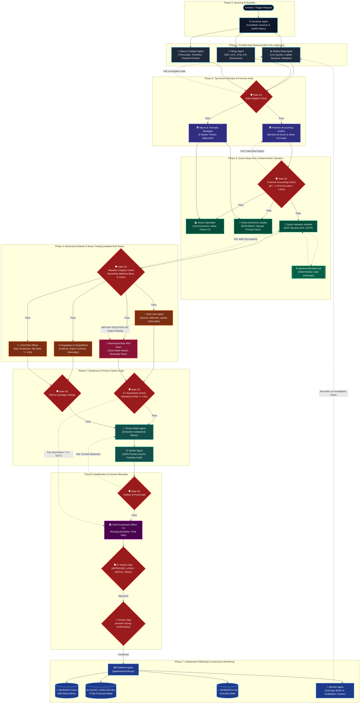

# Institutional Multi-Agent Hedge Fund & Tier-1 VC Equity Research System

> [🇹🇭 อ่านคู่มือภาษาไทย (Thai Version)](./README_TH.md) | [📖 Complete How-to-Use Guide](./HOW_TO_USE.md)

An institutional-grade equity research operating system modeled after premier global hedge funds (e.g. Tiger Cubs, Point72, Citadel) and Tier-1 venture capital firms (e.g. Sequoia, Founders Fund). 

It implements a rigorous multi-agent DAG architecture that strictly separates raw SEC/market data retrieval from analytical judgment, performs all valuation arithmetic via deterministic code (`pipeline/calculator.mjs`), subjects every investment thesis to an isolated adversarial short-seller attack, conducts forensic accounting audits (Beneish M-Score, Sloan Accrual Anomaly, Stock-Based Compensation economic dilution), enforces a disciplined institutional **"Passing Discipline"**, and compiles publication-grade Word investment memos (`RESEARCH.docx`) and 6-tab financial workbooks (`QUANT_ANALYSIS.xlsx`) directly onto the user's Desktop.

```text
investment-research/
├── SKILL.md                  # Comprehensive skill definition and execution modes
├── README.md                 # System overview and architectural reference
├── contracts/                # 23 Specialist Agent Contracts (19 active + 4 legacy aliases)
│   ├── cio-ic.yaml           # Chief Investment Officer & Investment Committee Chair
│   ├── macro-thematic.yaml   # Macro & Value Chain Thematic Strategist (5 Master Theses)
│   ├── sector-specialist.yaml# Sector Specialists (6 Institutional Coverage Groups)
│   ├── forensic-accounting.yaml # Beneish M-Score, Sloan Accruals, Real SBC Dilution (alias: earnings-quality.yaml)
│   ├── valuation-modeler.yaml# Quant & Deterministic Valuation Modeler (alias: valuation.yaml)
│   ├── bear-adversarial.yaml # Activist Short-Seller Red Team Stress Tester (alias: bear.yaml)
│   ├── regulatory-geopolitical.yaml # Antitrust, Export Controls & Sovereign Policy
│   ├── risk-officer.yaml     # Downside Floors, Leverage Limits & Position Sizing (alias: risk.yaml)
│   ├── orchestrator.yaml     # DAG Planner & Gate Routing
│   ├── market-data.yaml      # Live Quotes, Valuation Multiples & Capital Structure
│   ├── filings.yaml          # SEC 10-K, 10-Q, 8-K & Footnote Disclosures
│   ├── news-catalyst.yaml    # Earnings Transcripts & Channel Check Timelines
│   ├── moat-business.yaml    # Porter's Five Forces & ROIC/WACC Spread
│   ├── bull.yaml             # Secular Growth Drivers & Upside Optionality
│   ├── thesis-writer.yaml    # 8-Section Institutional Investment Memo Synthesizer
│   ├── verifier.yaml         # Citation Auditor & Primary Filing Verification (G6)
│   ├── publisher.yaml        # OpenXML DOCX & Multi-Tab XLSX Exporter
│   ├── screener.yaml         # Multi-Ticker Screening & GARP Filters
│   └── monitor.yaml          # Invalidation Trigger & Quarterly Earnings Watch
├── schemas/                  # 22 Validated JSON Schemas
│   ├── ic-verdict.schema.json
│   ├── macro-thematic-assessment.schema.json
│   ├── sector-deep-dive.schema.json
│   ├── forensic-report.schema.json
│   ├── regulatory-geopolitical-assessment.schema.json
│   ├── valuation-model.schema.json
│   ├── thesis-record.schema.json
│   ├── financial-snapshot.schema.json
│   ├── filings-extract.schema.json
│   ├── bear-case.schema.json
│   ├── bull-case.schema.json
│   ├── risk-register.schema.json
│   └── ...
├── pipeline/                 # Execution Pipeline & Engines
│   ├── calculator.mjs        # Zero-dependency deterministic financial calculator
│   ├── exporter.py           # Zero-dependency OpenXML DOCX & 6-Tab XLSX generator
│   ├── dag.yaml              # Multi-agent dependency graph with parallel & isolated groups
│   └── gates.yaml            # Quality Gates G1-G6, IC_VERDICT & HUMAN
├── prompts/                  # Specialist Role Prompts
│   ├── cio-ic.prompt.md
│   ├── macro-thematic.prompt.md
│   ├── sector-specialist.prompt.md
│   ├── forensic-accounting.prompt.md
│   ├── valuation-modeler.prompt.md
│   ├── bear-adversarial.prompt.md
│   ├── regulatory-geopolitical.prompt.md
│   └── risk-officer.prompt.md
├── references/               # Institutional Knowledge Base & Frameworks
│   ├── 5_MACRO_INVESTMENT_THESES.md   # Liquid Cooling, Agentic Rails, Physical AI, Edge AI, Defense
│   ├── PASSING_DISCIPLINE_FRAMEWORK.md # Case studies in saying NO (MU, ISRG, EQIX, BABA, AMBA)
│   ├── FORENSIC_ACCOUNTING_MANUAL.md   # Beneish M-Score, Sloan Accruals, Real SBC Dilution
│   ├── DETERMINISTIC_VALUATION_ENGINE.md # Multi-stage DCF, Reverse DCF solver, SOTP, Sensitivities
│   └── HEDGE_FUND_ORGANIZATIONAL_MANUAL.md # Firm hierarchy, IC voting, Fractional Kelly sizing
├── templates/                # Institutional Deliverable Templates
│   ├── INVESTMENT_MEMO_TEMPLATE.md     # 8-Section Wall Street / Tier-1 VC Memo
│   └── IC_VERDICT_TEMPLATE.md          # Investment Committee Formal Deliberation Record
└── tests/                    # Automated Verification Suite
    ├── test_calculator.mjs   # Node.js tests for DCF, Reverse DCF, SOTP, Beneish, Sloan
    ├── test_exporter.py      # Python tests for OpenXML DOCX and 6-tab XLSX compilation
    └── test_schemas.py       # Python test verifying all 22 JSON schema definitions
```

---

## Multi-Agent Architecture & DAG Sequencing

The system models a Tier-1 multi-agent DAG pipeline orchestrated across 8 sequential and parallel phases, enforcing strict quality gates and air-gap adversarial isolation:



---

## Core Institutional Architectural Principles

1. **Strict Separation of Retrieval and Judgment**:
   - Data agents (`market-data`, `filings`, `news-catalyst`) retrieve and parse primary sources. They never guess or speculate.
   - Analytical specialists (`forensic-accounting`, `macro-thematic`, `sector-specialist`, `valuation-modeler`, `bear-adversarial`, `risk-officer`, `cio-ic`) interpret existing data. They never browse the live web.
2. **Deterministic Arithmetic in Code (`pipeline/calculator.mjs`)**:
   - Valuation agents author assumptions only. All DCF cash flows, reverse DCF growth rate solvers, SOTP models, Beneish M-Scores, Sloan accrual ratios, Graham numbers, and 2D sensitivity matrices are computed by deterministic code.
   - Gate G3 verifies exact numerical reproducibility.
3. **The 3:1 Asymmetric Reward-to-Risk Hurdle**:
   - Long investments (`APPROVED_LONG`) must demonstrate at least a 3.0x upside to base fair value relative to the stress-tested downside bear floor.
4. **The Strict "Passing Discipline"**:
   - The Investment Committee strictly enforces institutional precedent, rejecting stocks that fail margin of safety hurdles:
     - **Cyclical Commodity Traps (`MU`)**: Peak multiples deceive; heavy capex burdens compress cash flows.
     - **Multiple Derating from Entrant Cannibalization (`ISRG`)**: 40x+ P/E unsustainable as Medtronic Hugo and J&J Ottava break surgical robot monopoly.
     - **Excessive Leverage (`EQIX`)**: Net Debt / EBITDA > 4.0x violates balance sheet risk ceilings.
     - **Structural Price Wars (`BABA`)**: Perpetual valuation compression from domestic market share losses.
     - **Scale Disadvantage (`AMBA`)**: Sub-scale R&D against hyperscale silicon giants.
5. **Adversarial Red Team Isolation**:
   - The Bear agent operates under an activist short-seller mandate (Muddy Waters / Hindenburg mindset), authoring at least 4 falsifiable objections and 2+ numeric kill criteria in strict isolation from the Bull agent.
6. **Exclusive Desktop Workspace**:
   - All research artifacts, financial workbooks, and memos are output directly to `~/Desktop/<TICKER>/`.

---

## Deliverables Generated

For every asset analyzed, the system generates:
- **`~/Desktop/<TICKER>/RESEARCH.docx`**: Full 8-Section Wall Street / Tier-1 VC Institutional Equity Research Memo with professional typography, stylized callouts, and dark navy headers.
- **`~/Desktop/<TICKER>/QUANT_ANALYSIS.xlsx`**: Institutional 6-Tab Financial Workbook:
  - Tab 1: Valuation Summary
  - Tab 2: DCF Projections & Capex Trajectory
  - Tab 3: Reverse DCF & Market Implied Growth
  - Tab 4: 2D Valuation Sensitivity Matrix (WACC vs Terminal Growth)
  - Tab 5: Forensic Accounting & Earnings Quality (Beneish M-Score, Sloan Accruals, SBC Dilution Walk)
  - Tab 6: Relative Multiples & SOTP Valuation
- **`~/Desktop/<TICKER>/RESEARCH.md`**: High-density executive markdown memo.
- **`~/Desktop/<TICKER>/ic-verdict.json`**: Formal Investment Committee deliberation and position sizing mandate.

---

---

## Quickstart: The `/goal` & `/boost` Workflow

When interacting with AI Agents (Antigravity, Claude Code, Cursor, Windsurf), you can unleash the institutional hedge fund research DAG using slash commands:

```text
/goal Conduct institutional valuation on CEG (Constellation Energy) for AI data center nuclear PPA tailwinds, enforcing 3:1 Asymmetry Hurdle.
/boost Spawn parallel data ingestion subagents, compute DCF and Reverse DCF via deterministic code, run an adversarial short-seller attack, and export RESEARCH.docx and 6-tab QUANT_ANALYSIS.xlsx directly to ~/Desktop/CEG/.
```

👉 **Read the complete guide:** [`HOW_TO_USE.md`](./HOW_TO_USE.md) (รายละเอียดคู่มือภาษาไทยและ Prompt สำเร็จรูป 5 สถานการณ์)

---

## Installation & Setup

Zero external dependencies. Node.js 18+ and Python 3.8+ only.

### 1. Global npm Installation (Recommended for Terminal CLI)
```bash
# Install globally from GitHub repository
npm install -g git+https://github.com/Bravetrunk/investment-research.git

# Verify CLI commands
investment-research --help
investment-research-calc --help
```

### 2. Zero-Install via `npx`
Run directly without installing:
```bash
# Run unified CLI
npx -y -p git+https://github.com/Bravetrunk/investment-research investment-research init CEG

# Compute DCF model directly
npx -y -p git+https://github.com/Bravetrunk/investment-research investment-research-calc ~/Desktop/CEG/valuation-model.json --write

# Launch MCP Server over stdio
npx -y -p git+https://github.com/Bravetrunk/investment-research investment-research-mcp
```

### 3. Agent Skill Directory (Antigravity / Local Agents)
```bash
mkdir -p ~/.gemini/config/skills/investment-research
git clone https://github.com/Bravetrunk/investment-research.git ~/.gemini/config/skills/investment-research
```

---

## AI Agent Compatibility Matrix

| AI Platform / Agent | Integration Method | Zero Install (`npx`) | Native MCP | Slash Commands (`/goal`, `/boost`) |
| :--- | :--- | :---: | :---: | :---: |
| **Google Antigravity** | Builtin Skill / Subagents / MCP | ✅ | ✅ | ✅ Full Native |
| **Claude Code** | Native MCP / `CLAUDE.md` / CLI | ✅ | ✅ | ✅ Full Native |
| **Cursor IDE** | MCP / `.cursorrules` / MDC Rule | ✅ | ✅ | ✅ Chat / Composer |
| **Windsurf (Cascade)** | MCP / `.windsurfrules` | ✅ | ✅ | ✅ Cascade Flow |
| **VS Code (Cline / Roo)** | MCP stdio Server | ✅ | ✅ | ✅ Interactive |
| **Claude Desktop** | MCP stdio Server | ✅ | ✅ | N/A |
| **OpenAI Codex / GPT-4o** | Function Calling JSON Schema | ✅ | via API | N/A |
| **xAI Grok** | Tool Calling API / System Prompt | ✅ | via API | N/A |
| **CrewAI / LangGraph** | Python Tool Adapters | N/A | N/A | ✅ Subclass / @tool |

### Claude Code MCP Setup
```bash
claude mcp add investment-research -- npx -y -p github:Bravetrunk/investment-research investment-research-mcp
```

### Cursor & Windsurf MCP Setup
Add to your MCP Settings or `~/.codeium/windsurf/mcp_config.json`:
```json
{
  "mcpServers": {
    "investment-research": {
      "command": "npx",
      "args": ["-y", "-p", "github:Bravetrunk/investment-research", "investment-research-mcp"]
    }
  }
}
```

---

## CLI Commands

```bash
# 1. Initialize research workspace on Desktop
investment-research init CEG

# 2. Compute deterministic valuation & write outputs back into file
investment-research calc ~/Desktop/CEG/valuation-model.json --write
investment-research calc ~/Desktop/CEG/valuation-model.json --verify

# 3. Direct fast calculator runner
investment-research-calc ~/Desktop/CEG/valuation-model.json --write

# 4. Compile publication Word memo & 6-tab Excel model
investment-research export CEG

# 5. Screen across multiple candidate tickers
investment-research screen CEG VST CCJ --out ~/Desktop/Power_Screen

# 6. Audit artifacts and quality gates
investment-research status CEG

# 7. Start Model Context Protocol (MCP) server
investment-research mcp
```

---

## Programmatic Node.js / TypeScript API

```javascript
import {
  dcf,
  solveReverseDCF,
  computeBeneishMScore,
  computeSloanAccrual,
  evaluatePassingDiscipline
} from "investment-research";

// Reverse DCF solver: calculate market-implied FCF growth CAGR
const revDcf = solveReverseDCF({
  currentPrice: 294.3,
  shares: 356.5,
  fcfBase: 3800.0,
  discountRate: 0.075,
  terminalGrowthRate: 0.025
});
console.log(`Implied Growth Rate: ${revDcf.implied_growth_pct}`);

// Evaluate institutional passing discipline
const check = evaluatePassingDiscipline({
  ticker: "EQIX",
  netDebtToEbitda: 5.2,
  peRatio: 45.0
});
console.log(`Verdict: ${check.verdict}`); // "PASSED" (saying NO to high leverage)
```

---

## Automated Verification Suite

Run all verification tests (zero dependencies):
```bash
npm test
# Or individually:
node tests/test_calculator.mjs
python3 tests/test_exporter.py
python3 tests/test_schemas.py
node tests/test_npm_package.mjs
```

---

## Documentation Links

- **End-to-End User Guide**: [`HOW_TO_USE.md`](./HOW_TO_USE.md)
- **Claude Code Guide**: [`CLAUDE.md`](./CLAUDE.md)
- **Comprehensive Skill Blueprint**: [`SKILL.md`](./SKILL.md)
- **OpenAI & Grok Integration**: [`integrations/openai_codex_agent.py`](./integrations/openai_codex_agent.py)
- **CrewAI Custom Tools**: [`integrations/crewai_tool.py`](./integrations/crewai_tool.py)
- **LangChain / LangGraph Tools**: [`integrations/langchain_tools.py`](./integrations/langchain_tools.py)
- **Web UI System Prompts**: [`integrations/system_prompts.md`](./integrations/system_prompts.md)
- **GitHub Repository**: [https://github.com/Bravetrunk/investment-research](https://github.com/Bravetrunk/investment-research)


