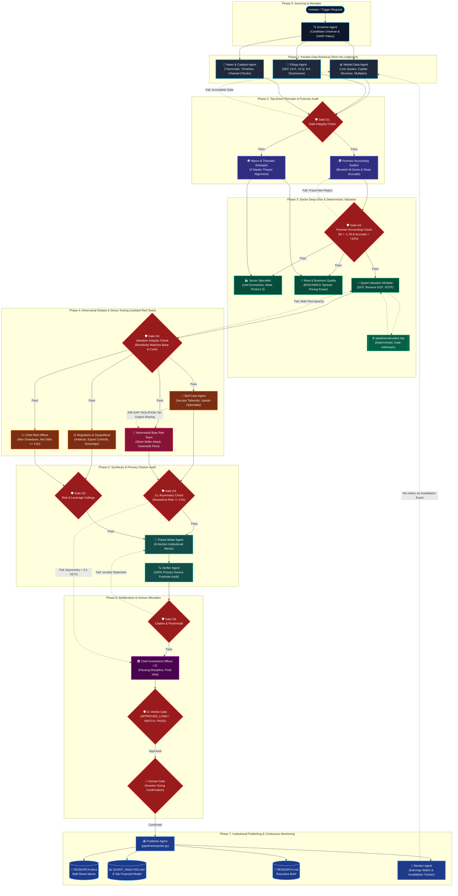

# ระบบวิจัยการลงทุนหุ้น Multi-Agent ระดับสถาบัน (Institutional Equity Research System)
### มาตรฐานระดับ Global Hedge Fund (Tiger Cubs, Point72, Citadel) และ Tier-1 Venture Capital (Sequoia, Founders Fund)

[](https://opensource.org/licenses/MIT)
[](https://nodejs.org)
[](https://python.org)
[](https://github.com/Bravetrunk/investment-research)
[](./README.md)

ระบบวิจัยและวิเคราะห์หุ้นเชิงลึกอัตโนมัติด้วยสถาปัตยกรรม **Multi-Agent Directed Acyclic Graph (DAG)** ที่จำลองกระบวนการทำงานของกองทุนชั้นนำระดับโลก ออกแบบมาเพื่อสร้าง **ความได้เปรียบทางข้อมูลและการประเมินมูลค่า (Informational & Analytical Edge)** ให้แก่นักลงทุน โดยขจัดข้อผิดพลาดจากการคาดเดาตัวเลขของ AI (LLM Hallucination) และยึดมั่นในวินัยการคัดกรองหุ้นอย่างเข้มงวด

---

## 📑 สารบัญ
1. [จุดเด่นและหลักการระดับสถาบัน (Institutional Principles)](#1-จุดเด่นและหลักการระดับสถาบัน)
2. [โครงสร้างทีมวิจัย 8 บทบาท (Multi-Agent Org Chart)](#2-โครงสร้างทีมวิจัย-8-บทบาท)
3. [ความต้องการของระบบและการติดตั้ง (Installation Guide)](#3-ความต้องการของระบบและการติดตั้ง)
4. [วิธีใช้งานระบบ (How to Use)](#4-วิธีใช้งานระบบ)
   - [4.1 สั่งผ่านบทสนทนากับ AI Agent (Natural Language)](#41-สั่งผ่านบทสนทนากับ-ai-agent)
   - [4.2 การใช้งานขั้นสูงด้วยคำสั่ง `/goal` และ `/boost`](#42-การใช้งานขั้นสูงด้วยคำสั่ง-goal-และ-boost)
   - [4.3 สั่งงานผ่าน Command-Line Interface (CLI)](#43-สั่งงานผ่าน-command-line-interface-cli)
   - [4.4 การเชื่อมต่อกับ AI Agents ทั่วไปผ่าน MCP (Cursor, Claude, Windsurf, Cline)](#44-การเชื่อมต่อผ่าน-model-context-protocol-mcp)
5. [ผลลัพธ์และเอกสารส่งมอบ (Deliverables)](#5-ผลลัพธ์และเอกสารส่งมอบ)
6. [การทดสอบความถูกต้องของระบบ (Automated Test Suites)](#6-การทดสอบความถูกต้องของระบบ)

---

## 1. จุดเด่นและหลักการระดับสถาบัน

1. **Deterministic Arithmetic in Code (คำนวณด้วยโค้ดจริง 100%)**:  
   ห้ามโมเดลภาษา (LLM) ทำนายตัวเลขลอย ๆ การประเมินมูลค่าทั้งหมด (DCF, Reverse DCF, SOTP, Trajectory Capex, Graham Number, Sensitivity Matrix) ถูกคำนวณผ่านโปรแกรมคณิตศาสตร์ที่ตรวจสอบผลลัพธ์ได้ทศนิยมระดับเซนต์ (`pipeline/calculator.mjs`)
2. **Strict Passing Discipline (วินัยในการปฏิเสธหุ้น)**:  
   ยึดหลักการของสุดยอดนักลงทุน: *"หุ้นที่ทำกำไรให้เรามากที่สุด คือหุ้นแย่ ๆ ที่เราเลือกไม่ซื้อ"* ระบบมีเกณฑ์ Veto หุ้นทันทีหากพบ Cyclical Commodity Traps (เช่น `MU`), Multiple Derating จากคู่แข่งกินรวบ (เช่น `ISRG`), หรือหนี้สูงเกินเกณฑ์ Net Debt / EBITDA > 4.0x (เช่น `EQIX`)
3. **The 3:1 Asymmetric Reward-to-Risk Hurdle**:  
   หุ้นที่จะได้รับการอนุมัติซื้อ (`APPROVED_LONG`) จะต้องมีสัดส่วน Upside ไปยัง Base Fair Value สูงกว่า Downside ไปยัง Bear Floor อย่างน้อย **3.0 เท่า**
4. **Forensic Accounting Audit (ตรวจจับการตกแต่งบัญชี)**:  
   คำนวณโมเดล **Beneish M-Score 8-Variable** (แจ้งเตือนหาก $M > -1.78$) และ **Sloan Accrual Anomaly** (แจ้งเตือนหากค่า Accrual เกิน $+10\%$ ของสินทรัพย์) พร้อมคิดผลกระทบจาก Stock-Based Compensation (SBC) เจือจางผู้ถือหุ้น
5. **Adversarial Red Team Attack (จำลองการโจมตีจาก Short-Seller)**:  
   บังคับให้ Bear Agent สวมบทบาทนักชอร์ตระดับโลก (Hindenburg, Muddy Waters) ตั้งใจเจาะทำลายสมมติฐาน Bull Case กำหนดข้อโต้แย้งที่พิสูจน์ค้านได้ และกำหนดเกณฑ์ตัดขาดทุน/เลิกเชื่อ (Numeric Kill Criteria)

---

## 2. โครงสร้างทีมวิจัย 8 บทบาท

ระบบทำงานร่วมกันผ่าน Typed Contracts (`contracts/`) และ JSON Schemas (`schemas/`):



### รายละเอียดการจัดเรียงลำดับ Agent แต่ละเฟส (Execution Phasing & Hand-offs):

1. **Phase 0: Sourcing & Ticker Trigger (`screener`)**  
   คัดเลือกหุ้นจาก Universe ตามธีม หรือรับคำสั่งวิเคราะห์รายตัวจากนักลงทุน
2. **Phase 1: Parallel Data Retrieval (`market-data`, `filings`, `news-catalyst`)**  
   - **หลักการ No-Judgment**: ดึงเฉพาะข้อเท็จจริงดิบจาก 10-K, 10-Q และราคาตลาด ห้ามตีความเองเด็ดขาด  
   - **Gate G1**: ตรวจสอบความครบถ้วนของข้อมูลก่อนส่งต่อ
3. **Phase 2: Top-Down Thematic & Forensic Audit (`macro-thematic`, `forensic-accounting`)**  
   - วิเคราะห์ความสอดคล้องกับ 5 Master Theses ควบคู่กับการสแกนงบด้วย **Beneish M-Score** และ **Sloan Accruals**  
   - **Gate G2**: หากพบความเสี่ยงการตกแต่งบัญชี จะระงับการวิเคราะห์หรือแจ้งเตือนทันทีก่อนเริ่มประเมินมูลค่า
4. **Phase 3: Sector Deep Dive & Deterministic Valuation (`sector-specialist`, `moat-business`, `valuation-modeler`)**  
   - วิเคราะห์ Unit Economics และความยั่งยืนของ Moat  
   - **Deterministic Code Hook**: คำนวณ DCF, Reverse DCF และ SOTP ด้วยโค้ดจริง `pipeline/calculator.mjs`  
   - **Gate G3**: ตรวจสอบผลลัพธ์ทางคณิตศาสตร์ ต้องไม่มีการคำนวณที่ขัดแย้งกัน (Base Case ต้องตรงกับ Sensitivity Matrix ระดับเซนต์)
5. **Phase 4: Adversarial Debate & Stress Testing (`bull`, `bear-adversarial`, `regulatory-geopolitical`, `risk-officer`)**  
   - **Air-Gap Isolation**: แยกทีม Bull และ Bear ห้ามเห็นข้อความของกันและกัน เพื่อป้องกันการประนีประนอมหรือเกิด Groupthink  
   - **Gate G4**: ตรวจสอบสัดส่วนผลตอบแทนต่อความเสี่ยง (**Asymmetry Hurdle $\ge 3:1$**)  
   - **Gate G5**: ตรวจสอบเพดานหนี้สิน ($Net\ Debt / EBITDA \le 4.0x$) และความเสี่ยงทางกฎหมาย
6. **Phase 5: Synthesis & Primary Citation Audit (`thesis-writer`, `verifier`)**  
   - รวบรวมข้อสรุปทั้งหมดเป็นบันทึกการลงทุน 8 บทความ  
   - **Gate G6**: ตรวจสอบแหล่งอ้างอิงเชิงประจักษ์ (Primary SEC Footnotes) 100% ห้ามมีข้อความลอย ๆ
7. **Phase 6: Deliberation & Human Oversight (`cio-ic`)**  
   - ประธานคณะกรรมการลงทุนประเมินมติขั้นเด็ดขาด (**APPROVED_LONG**, **WATCHLIST**, หรือ **PASSED_STRICT_DISCIPLINE**)  
   - ส่งต่อให้นักลงทุนมนุษย์ยืนยันขนาด Position Sizing (Fractional Kelly)
8. **Phase 7: Institutional Publishing & Continuous Monitoring (`publisher`, `monitor`)**  
   - สร้างไฟล์ Word (`RESEARCH.docx`), Excel 6 แท็บ (`QUANT_ANALYSIS.xlsx`), และ Markdown สรุปผล  
   - ส่งมอบเข้าสู่ระบบติดตามผล (`monitor`) คอยเฝ้าระวัง Invalidation Trigger และรายงานผลประกอบการไตรมาสใหม่

- **CIO / Investment Committee (`cio-ic`)**: ประธานคณะกรรมการลงทุน ถือสิทธิ์ Veto และบังคับใช้ Passing Discipline
- **Forensic Accounting Auditor (`forensic-accounting`)**: ตรวจสอบคุณภาพงบการเงิน, ตรวจจับ Accruals ผิดปกติ, และสืบไส้ในหมายเหตุประกอบงบ
- **Macro & Thematic Strategist (`macro-thematic`)**: วิเคราะห์แนวโน้มมหภาคและเชื่อมโยงกับ 5 Master Theses (Liquid Cooling, Agentic Payments, Physical AI, Edge AI, Allied Rearmament)
- **Sector Specialist (`sector-specialist`)**: เจาะลึก Unit Economics, วงจรผลิตภัณฑ์, โมเดลธุรกิจ, และ Moat
- **Quant Valuation Modeler (`valuation-modeler`)**: รันโมเดลประเมินมูลค่าเชิงคณิตศาสตร์ (DCF, Reverse DCF, SOTP)
- **Adversarial Bear Red Team (`bear-adversarial`)**: ทีมโจมตีสมมติฐาน ประเมินกรณีเลวร้ายที่สุด (Worst-case Scenario)
- **Regulatory & Geopolitical Analyst (`regulatory-geopolitical`)**: ประเมินความเสี่ยงด้านกฎหมาย กฎระเบียบ Antitrust และการคว่ำบาตร
- **Chief Risk Officer (`risk-officer`)**: คำนวณขนาดการลงทุนที่เหมาะสมด้วย Fractional Kelly Criterion

---

## 3. ความต้องการของระบบและการติดตั้ง

ระบบออกแบบตามหลักการ **Zero External Dependencies** ใช้เฉพาะ Node.js Runtime และ Python Standard Library ไม่ต้องลง Library ภายนอกเพิ่มเติม:

- **Node.js**: เวอร์ชัน `18.0.0` หรือสูงกว่า
- **Python**: เวอร์ชัน `3.8` หรือสูงกว่า

### 3.1 ติดตั้งทั่วทั้งเครื่องผ่าน npm (`npm install -g`) [แนะนำ]
```bash
npm install -g git+https://github.com/Bravetrunk/investment-research.git
```

### 3.2 ใช้งานทันทีโดยไม่ต้องติดตั้ง (`npx`) [Zero-Install]
```bash
# ทดสอบรันดูคำสั่งทั้งหมด
npx -y -p git+https://github.com/Bravetrunk/investment-research investment-research --help

# รัน Model Context Protocol (MCP) Server สำหรับเชื่อมต่อกับ Agent
npx -y -p git+https://github.com/Bravetrunk/investment-research investment-research-mcp
```

### 3.3 ติดตั้งเป็น Antigravity Skill
```bash
git clone https://github.com/Bravetrunk/investment-research.git ~/.gemini/config/skills/investment-research
```

---

## 4. วิธีใช้งานระบบ

### 4.1 สั่งผ่านบทสนทนากับ AI Agent (Natural Language)
หากคุณใช้งานผ่าน Antigravity หรือ Agent ที่ติดตั้งสกิลนี้ไว้ สามารถสั่งวิเคราะห์หุ้นได้ทันทีด้วยภาษาไทย:

> *"ช่วยวิเคราะห์หุ้น `CEG` (Constellation Energy) แบบ Institutional Deep-Dive เต็มรูปแบบตามมาตรฐาน investment-research skill ให้ทำโมเดล DCF, สแกนงบการเงิน, ให้ Bear Team โจมตี และส่งไฟล์ Word กับ Excel ไปที่หน้า Desktop"*

---

### 4.2 การใช้งานขั้นสูงด้วยคำสั่ง `/goal` และ `/boost`
ระบบนี้รองรับ Directive พิเศษสำหรับงานวิจัยระดับลึกที่สุด:

- **/goal**: สั่งให้ Agent ทำงานอย่างละเอียดรอบคอบสูงสุดแบบไม่หยุดจนกว่าจะสำเร็จ (Run until 100% complete) เหมาะสำหรับงานวิจัยข้ามคืน
- **/boost**: สั่งให้ Agent ใช้โครงสร้างทีม Multi-Agent ข้ามสายงาน สลับกันคานอำนาจและตรวจสอบข้ามมิติ

#### ชุดคำสั่งสำเร็จรูป (Prompt Cheat Sheet):

**1) วิเคราะห์หุ้นรายตัวอย่างเข้มข้นที่สุด (Single-Ticker Deep Dive)**
```text
/goal /boost ทำการวิเคราะห์หุ้น CEG แบบ Institutional-Grade เต็มรูปแบบ:
1. สแกนงบ 10-K และคำนวณ Beneish M-Score กับ Sloan Accruals
2. วิเคราะห์ Moat พลังงานนิวเคลียร์และ PPA กับ Microsoft
3. ให้ Bear Red Team จำลองกรณี Multiple Compression และราคาไฟตกต่ำ
4. คำนวณ DCF, Reverse DCF และตรวจสอบ Gate G3
5. ประเมินมติ IC Verdict และคำนวณ Kelly Position Sizing
6. ส่งออก QUANT_ANALYSIS.xlsx และ RESEARCH.docx ไปยัง ~/Desktop/CEG/
```

**2) สกรีนเปรียบเทียบหุ้นทั้งกลุ่มอุตสาหกรรม (Thematic Sector Screen)**
```text
/goal /boost ช่วยสกรีนเปรียบเทียบหุ้นกลุ่ม Liquid Cooling & Power (CEG, VST, VRT, ETN, MOD):
1. เปรียบเทียบ Valuation Multiples, Net Debt/EBITDA และ ROIC
2. ทำ Reverse DCF เพื่อดูว่าตัวไหนถูกคาดหวังการเติบโตสูงเกินจริง
3. คัดกรองหุ้นตามเกณฑ์ Passing Discipline
4. สรุปผลลงใน SCREEN_COMPARISON.xlsx บนเดสก์ท็อป
```

---

### 4.3 สั่งงานผ่าน Command-Line Interface (CLI)

```bash
# 1. สร้างโฟลเดอร์งานวิจัยและเทมเพลตสำหรับหุ้นเป้าหมาย (เช่น CEG)
investment-research init CEG

# 2. คำนวณโมเดลการเงิน (DCF, Reverse DCF, SOTP, Forensics) และบันทึกผลกลับลงไฟล์
investment-research calc ~/Desktop/CEG/valuation-model.json --write

# 3. ตรวจสอบความถูกต้องทางคณิตศาสตร์ตามมาตรฐาน Gate G3
investment-research verify ~/Desktop/CEG/valuation-model.json

# 4. ดูสถานะความคืบหน้าของงานวิจัย
investment-research status CEG

# 5. ส่งออกเอกสาร Word (.docx) และ Excel 6 แท็บ (.xlsx) สมบูรณ์แบบ
investment-research export ~/Desktop/CEG

# 6. รันสกรีนนิ่งเปรียบเทียบหุ้นหลายตัวพร้อมกัน
investment-research screen CEG VST CCJ --out ~/Desktop/Power_Screen/
```

---

### 4.4 การเชื่อมต่อผ่าน Model Context Protocol (MCP)
สามารถเชื่อมต่อสกิลนี้เข้ากับ **Cursor IDE**, **Claude Desktop**, **Windsurf**, หรือ **VS Code (Cline / Roo Code)** ได้ทันที โดยเพิ่มการตั้งค่า MCP:

```json
{
  "mcpServers": {
    "investment-research": {
      "command": "npx",
      "args": [
        "-y",
        "-p",
        "git+https://github.com/Bravetrunk/investment-research.git",
        "investment-research-mcp"
      ]
    }
  }
}
```

เมื่อเชื่อมต่อแล้ว Agent ใน IDE จะสามารถเรียกใช้ Tool ต่าง ๆ เช่น `calculate_valuation`, `solve_reverse_dcf`, `calculate_forensic_accounting`, `export_research_artifacts` ได้โดยอัตโนมัติ

---

## 5. ผลลัพธ์และเอกสารส่งมอบ

ทุกงานวิจัยจะส่งมอบเอกสารเกรดสถาบันไปยัง `~/Desktop/<TICKER>/`:

1. **`QUANT_ANALYSIS.xlsx` (Institutional Financial Model 6 แท็บ)**:
   - `Executive_Summary`: สรุป Valuation Snapshot, Multiples และมติ IC
   - `DCF_Model`: Projected FCF พร้อม Discount Factor และ Enterprise Value
   - `Reverse_DCF`: Implied FCF Growth vs Market Consensus Expectations
   - `Sensitivity_Matrix`: ตารางความอ่อนไหว 2D ระหว่าง WACC และ Terminal Growth Rate
   - `SOTP_Valuation`: ประเมินมูลค่าแยกตามส่วนงานธุรกิจ
   - `Forensic_Accounting`: แจกแจงตัวเลข Beneish M-Score และ Sloan Accrual
2. **`RESEARCH.docx` (Institutional Investment Memo 8 บทความ)**:
   - เอกสารบทวิเคราะห์ระดับ Wall Street จัดฟอร์แมตสวยงามพร้อมพิมพ์/ส่งต่อผู้บริหาร
3. **`RESEARCH.md`**:
   - เอกสาร Markdown สำหรับอ่านและทบทวนอย่างรวดเร็ว
4. **`ic-verdict.json`**:
   - บันทึกมติคณะกรรมการลงทุน, คะแนน Conviction (1-10), และสัดส่วน Position Sizing

---

## 6. การทดสอบความถูกต้องของระบบ

รันการทดสอบครบวงจร 5 Suite ด้วยคำสั่งเดียว:

```bash
npm test
```

ผลการทดสอบ:
- ✅ **Financial Calculator Engine**: ผ่านการทดสอบ 15 ข้อ (DCF, Explicit Capex, Reverse DCF Solver, SOTP, Beneish, Sloan, Kelly, Edge Cases)
- ✅ **OpenXML Exporter**: ผ่านการทดสอบสร้างไฟล์ Word และ Excel 6 แท็บสมบูรณ์
- ✅ **JSON Schemas**: ตรวจสอบผ่านทั้ง 22 สัญญา
- ✅ **CLI & MCP Server**: ผ่านการทดสอบคำสั่ง CLI และ JSON-RPC 2.0 Stdio ครบทั้ง 8 เครื่องมือ
- ✅ **Dispatcher Integrations**: รองรับการเรียกใช้ผ่าน OpenAI Codex / LangChain / CrewAI

---

## เอกสารอ้างอิงเพิ่มเติม
- 📖 [คู่มือการใช้งานและการแก้ปัญหาฉบับละเอียด (HOW_TO_USE.md)](./HOW_TO_USE.md)
- 🏛️ [English Architecture Guide (README.md)](./README.md)
- 💡 [5 Master Investment Theses Reference](./references/5_MACRO_INVESTMENT_THESES.md)
